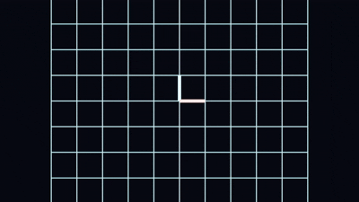
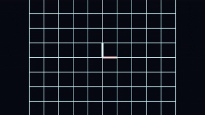
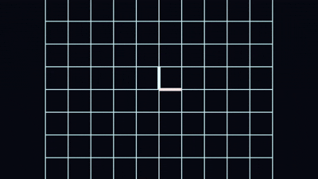
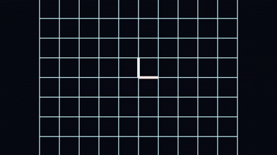
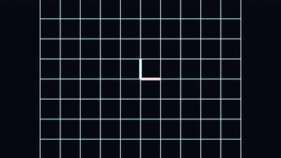
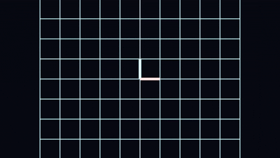

# 🌌 Linear Algebra Visual Engine
### Project 01 — 2D Linear Transformation Animator

> *"Watch space bend, rotate, shear and collapse in real time."*


---

## 🎬 Phase 2 — Blender bpy Cinematic Renders
*1920×1080 · 60fps · EEVEE · Emission Shaders · Geometry Nodes · Shape Key Animation*

| Rotation 90° | Shear | Scale 2x |
|:---:|:---:|:---:|
|  |  |  |
| det = 1 · area preserved | det = 1 · grid slides | det = 4 · area ×4 |

| det = 0 Collapse | Reflection x | det < 0 Flip | Projection x |
|:---:|:---:|:---:|:---:|
|  |  |  |  |
| Space folds to a line | det = -1 · mirrors | det = -1 · flips | det = 0 · collapses to axis |

---

## 🎬 Phase 1 — Python + Matplotlib Preview

| Rotation 90° | Shear | Scale 2x |
|:---:|:---:|:---:|
|  |  |  |

| det = 0 Collapse | Identity |
|:---:|:---:|
|  |  |

---

## 🧠 What This Proves

This is not a tutorial project. Every line of code here **visually proves** a concept from linear algebra — the same concepts that power every AI model, graphics engine, and physics simulation on the planet.

| Concept | What You See |
|---|---|
| **Basis vectors î ĵ** | Red + teal arrows morphing live with the grid |
| **Matrix × vector** | Every point in 2D space multiplied by M |
| **Linear transformation** | Grid morphing smoothly from identity → M |
| **det(M) as area scale** | Grid stretches/shrinks by exactly det(M) |
| **det = 0 collapse** | Space folds into a line — no inverse exists |
| **det < 0 flip** | Orientation inverts — space turns inside out |
| **Composition M₂M₁** | Two transforms chained, proves det(M₂M₁) = det(M₂)·det(M₁) |

---

## 🏗️ Build System — 2 Phases

```
Phase 1 → Python + NumPy + Matplotlib    ✅ Complete
   Prove the math works. Pure logic. Runs in terminal.

Phase 2 → Blender 5 + bpy               ✅ Complete
   Same math. GPU-rendered cinematic dark void.
   Shape Keys + Geometry Nodes + EEVEE + 1080p 60fps.
```

---

## 📁 Project Structure

```
LA-Visual-Engine/
│
├── 📄 README.md
│
├── 🐍 Phase_1_Logic/
│   ├── matrices.py           ← All 8 transformation matrices + presets dict
│   ├── math_utils.py         ← lerp, compose, det_status, verify_composition
│   └── preview.py            ← Matplotlib CLI animator — run this
│
├── 🎨 Phase_2_Blender/
│   ├── scenes/
│   │   └── transform.py      ← Entry point — change PRESET_NAME and run
│   └── utils/
│       ├── materials.py      ← Emission shader system
│       ├── scene_builder.py  ← Grid, arrows, camera, Geometry Nodes thickness
│       └── animator.py       ← Shape Key animation + Blender 5.0 interpolation
│
└── 📸 docs/assets/
    ├── phase2_renders/       ← 7 Blender cinematic renders (GIF)
    └── *.gif                 ← Phase 1 Matplotlib previews
```

---

## 🚀 Quick Start

### Phase 1 — Python Logic
```bash
pip3 install numpy matplotlib
cd Phase_1_Logic
python3 preview.py
```

### Phase 2 — Blender Cinematic
```
1. Open Blender 5.x
2. Scripting tab → Open → Phase_2_Blender/scenes/transform.py
3. Set PRESET_NAME = "shear"  (or any of the 8 presets)
4. ▶ Run Script
5. Render → Render Animation  (Ctrl+F12)
```

**8 presets available:**
```
identity       → No change          det =  1
rotation_90    → Rotate 90°         det =  1  (area preserved)
shear          → Horizontal shear   det =  1  (area preserved)
scale2x        → Scale 2x           det =  4  (area ×4)
reflection_x   → Reflect over x     det = -1  (orientation flips)
projection_x   → Project to x-axis  det =  0  (collapse!)
det_0_collapse → Space collapses    det =  0
det_neg_flip   → Orientation flip   det = -1
```

---

## 🔬 The Linear Algebra Explained

### What is a Linear Transformation?
```
[a  b] [x]   [ax + by]
[c  d] [y] = [cx + dy]
```
Every point in the grid moves — lines stay parallel, origin stays fixed.

### Why does det(M) matter?
```
det = 1   →  Area unchanged    (rotation, reflection)
det = 4   →  Area ×4           (scale 2x in both directions)
det = 0   →  Area = 0          (space collapsed — no inverse!)
det < 0   →  Orientation flip  (space turns inside out)
```

### The composition rule
```
M_total = M₂ · M₁     (order matters — NOT commutative)
det(M₂ · M₁) = det(M₂) × det(M₁)
```

---

## 📐 Part of the Simulation Architect Path — 10 Projects Total

| # | Project | Core Concept | Status |
|---|---|---|---|
| **01** | **2D Linear Transform Animator** ← *here* | Vectors, Det, Basis | ✅ Both phases done |
| 02 | Coordinate System Translator | Change of Basis | ⏳ |
| 03 | Geometric Linear System Solver | Cramer's Rule | ⏳ |
| 04 | Eigenvector Explorer | Eigenvalues, Stable Axes | ⏳ |
| 05A | Solar System Simulator | Real Physics + NASA JPL API | ⏳ |
| **05B** | **PROJECT VOID** | Non-Uniform Gravity + Custom A* | ⏳ |
| 06 | Neural Network Visual Simulator | Backprop, PyTorch | ⏳ |
| 07 | Optical Fiber & Internet Simulator | Wave Physics | ⏳ |
| 08 | VOID AI — RL Navigator | Gymnasium + SB3 | ⏳ |
| 09 | Omniverse Digital Twin | OpenUSD + NVIDIA Omniverse | ⏳ |

---

## 🧰 Tech Stack

| Tool | Purpose |
|---|---|
| **Python 3.12+** | Core language |
| **NumPy** | Matrix operations, vector math, LA engine |
| **Matplotlib** | Phase 1 — 2D visualization |
| **Blender 5 + bpy** | Phase 2 — 3D GPU-rendered cinematic |
| **Geometry Nodes** | Procedural 3D tube generation from math lines |
| **Shape Keys** | Crash-proof vertex animation in Blender |
| **Taichi Lang** | GPU physics (from Project 05A onwards) |
| **PyTorch** | Neural networks + RL (Projects 06, 08) |
| **NVIDIA Omniverse** | Endgame simulation platform (Project 09) |

---

## 👨‍💻 Author

**Divyansh Ailani** — Simulation Architect in progress

*BCA Student · Kanpur, India → The World*

> "Mathematics is the language of the universe. I am learning to read it."

[](https://www.linkedin.com/in/divyansh-ailani-225925380/)
[](https://github.com/divyanshailani)

---

*Part of the **Simulation Architect Path** — from linear algebra to NVIDIA Omniverse. 🌌*
