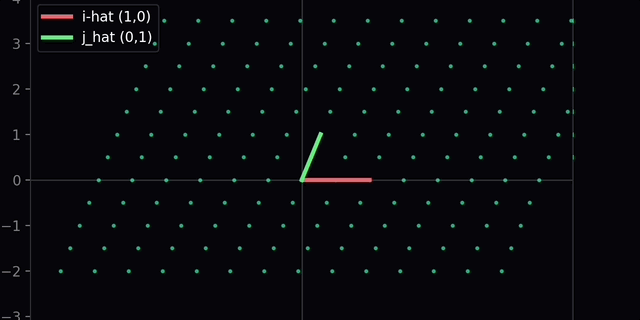
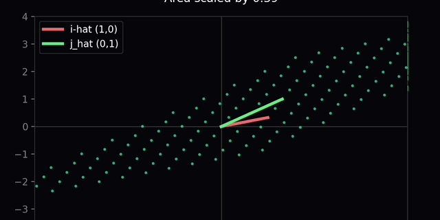
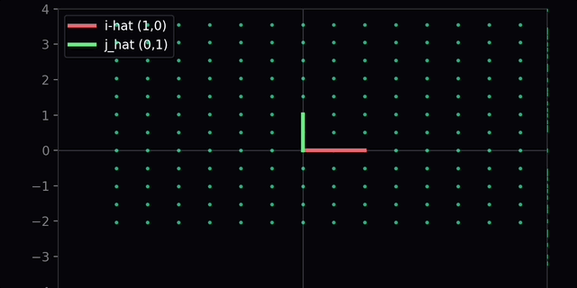
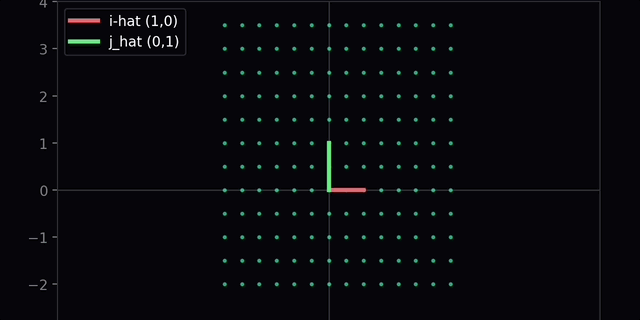
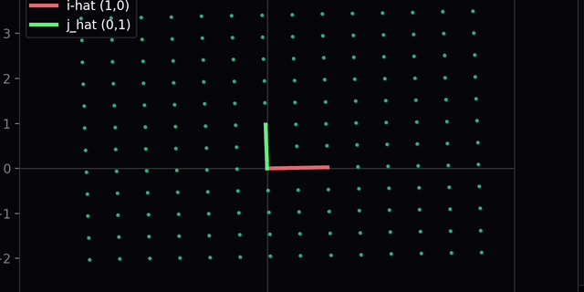

# 🌌 Linear Algebra Visual Engine
### Project 01 — 2D Linear Transformation Animator

> *"Watch space bend, rotate, shear and collapse in real time."*


---

## 🎬 Live Demo — Phase 1

> Run `python3 preview.py` and pick any preset. Here's what it looks like:

| Rotation 90° | Shear | Scale 2x |
|:---:|:---:|:---:|
|  |  |  |
| det = 1 · area preserved · î ĵ swap | det = 1 · grid slides · shape changes | det = 4 · area grows by 4× |

| det = 0 Collapse | Identity |
|:---:|:---:|
|  |  |
| Space folds to a line · no inverse exists | The untransformed baseline |

---

## 🧠 What This Proves

This is not a tutorial project. Every line of code here **visually proves** a concept from linear algebra — the same concepts that power every AI model, graphics engine, and physics simulation on the planet.

| Concept | What You See |
|---|---|
| **Basis vectors î ĵ** | Red + teal arrows morphing live with the grid |
| **Matrix × vector** | Every point in 2D space multiplied by M |
| **Linear transformation** | Grid morphing smoothly from identity → M |
| **det(M) as area scale** | Grid stretches/shrinks by exactly det(M) |
| **det = 0 collapse** | Space folds into a line — no inverse exists |
| **det < 0 flip** | Orientation inverts — space turns inside out |
| **Composition M₂M₁** | Two transforms chained, proves det(M₂M₁) = det(M₂)·det(M₁) |

---

## 🏗️ Build System — 2 Phases

```
Phase 1 → Python + NumPy + Matplotlib    ✅ Complete
   Prove the math works. Pure logic. Runs in terminal.

Phase 2 → Blender bpy                   ⏳ Coming post-exams
   Same math. Now GPU-rendered in 3D cinematic dark void.
```

---

## 📁 Project Structure

```
LA-Visual-Engine/
│
├── 📄 README.md
│
├── 🐍 Phase_1_Logic/
│   ├── matrices.py      ← All 8 transformation matrices + presets dict
│   ├── math_utils.py    ← lerp, compose, det_status, verify_composition
│   └── preview.py       ← Matplotlib CLI animator — run this
│
├── 🎨 Phase_2_Blender/  ← Coming post-exams
│   ├── scenes/
│   └── utils/
│
└── 📸 docs/assets/      ← Demo GIFs
```

---

## 🚀 Quick Start

```bash
# Install dependencies
pip3 install numpy matplotlib

# Run the animator
cd Phase_1_Logic
python3 preview.py
```

**Choose from 8 presets when prompted:**
```
identity       → No change          det =  1
rotation_90    → Rotate 90°         det =  1  (area preserved)
shear          → Horizontal shear   det =  1  (area preserved)
scale2x        → Scale 2x           det =  4  (area ×4)
reflection_x   → Reflect over x     det = -1  (orientation flips)
projection_x   → Project to x-axis  det =  0  (collapse!)
det_0_collapse → Space collapses    det =  0
det_neg_flip   → Orientation flip   det = -1
```

---

## 🔬 The Linear Algebra Explained

### What is a Linear Transformation?
A 2×2 matrix **M** transforms every vector **v** in 2D space:
```
[a  b] [x]   [ax + by]
[c  d] [y] = [cx + dy]
```
The entire grid moves — grid lines stay parallel, origin stays fixed. That's what "linear" means.

### Why does det(M) matter?
```
det = 1   →  Area unchanged    (rotation, reflection)
det = 4   →  Area ×4           (scale 2x in both directions)
det = 0   →  Area = 0          (space collapsed — no inverse!)
det < 0   →  Orientation flip  (space turns inside out)
```

### The composition rule
```
M_total = M₂ · M₁     (order matters — NOT commutative)
det(M₂ · M₁) = det(M₂) × det(M₁)
```

---

## 📐 Part of the Simulation Architect Path — 10 Projects Total

| # | Project | Core Concept | Status |
|---|---|---|---|
| **01** | **2D Linear Transform Animator** ← *here* | Vectors, Det, Basis | 🔄 Phase 1 done |
| 02 | Coordinate System Translator | Change of Basis | ⏳ |
| 03 | Geometric Linear System Solver | Cramer's Rule | ⏳ |
| 04 | Eigenvector Explorer | Eigenvalues, Stable Axes | ⏳ |
| 05A | Solar System Simulator | Real Physics + NASA JPL API | ⏳ |
| **05B** | **PROJECT VOID** | Non-Uniform Gravity + Custom A* | ⏳ |
| 06 | Neural Network Visual Simulator | Backprop, PyTorch | ⏳ |
| 07 | Optical Fiber & Internet Simulator | Wave Physics | ⏳ |
| 08 | VOID AI — RL Navigator | Gymnasium + SB3 | ⏳ |
| 09 | Omniverse Digital Twin | OpenUSD + NVIDIA Omniverse | ⏳ |

---

## 🧰 Tech Stack

| Tool | Purpose |
|---|---|
| **Python 3.12+** | Core language |
| **NumPy** | Matrix operations, vector math, LA engine |
| **Matplotlib** | Phase 1 — 2D visualization and animation |
| **Blender 5 + bpy** | Phase 2 — 3D GPU-rendered cinematic |
| **Taichi Lang** | GPU physics acceleration (from Project 05A) |
| **PyTorch** | Neural networks + RL (Projects 06, 08) |
| **NVIDIA Omniverse** | Endgame simulation platform (Project 09) |

---

## 👨‍💻 Author

**Divyansh Ailani** — Simulation Architect in progress

*BCA Student · Kanpur, India → The World*

> "Mathematics is the language of the universe. I am learning to read it."

[](https://www.linkedin.com/in/divyansh-ailani-225925380/)
[](https://github.com/divyanshailani)

---

*Part of the **Simulation Architect Path** — from linear algebra to NVIDIA Omniverse. 🌌*
